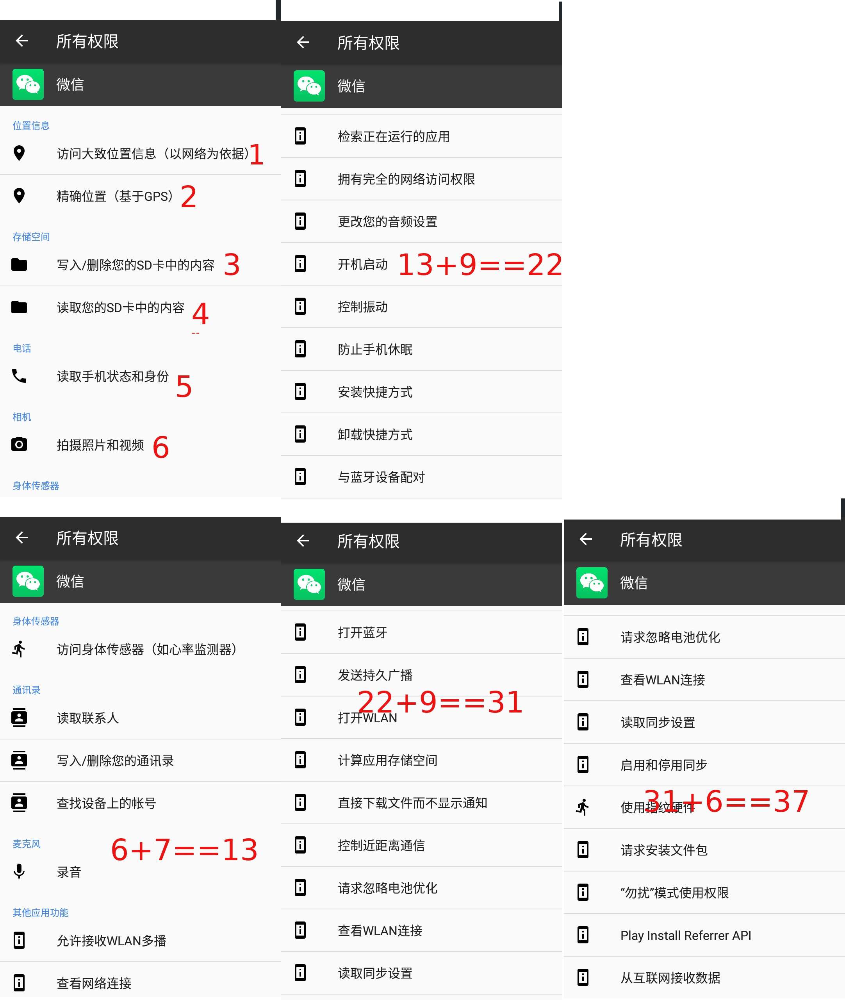

+++
title = " 4 如果您是微信 wechat 用户，你处于危险之中 "
description = " 00_q_and_answer "
weight = 20
+++

# 给微信 wechat 用户的忠告

## [安全上网的第4步:如果您是微信 wechat 用户，你处于危险之中](https://github.com/marstool/marstools/tree/master/weiXin)

    关于微信监控：很多人，都不相信微信全面录音。我这样说吧：我2001年，就听到电信总部工作的同学说，千万不要在电话里说秘密，因为总部在长途局设立了录音中心，全部录音。现在已经过了18年！那个时候，硬盘是1G每个。现在是10T每个，大了一万倍。而，录音，需要的资源是可以计算出来的：

  假设，微信，用32kbit的方式，单路录音，回传服务器，那么，每秒钟需要4kbyte,每天345Mbyte。这是没有静音检测完全录音的所需要的硬盘容量。如果，加上静音检测，也就是有人说话再录音，那么，假设平均只有10%时间在说话，那么35M，就可以录一天音了。每个月1G每人。一个10T的硬盘，可以存储1万人一个月的音。而一个10T硬盘，只需要1000－2000CNY。批量采购，1万个，就可以存储1千万人一个月。而这只需要2000万经费！以上假设，是录音算法采用的是普通算法，质量非常高(32kbit)，不压缩。加压缩算法，压缩到原来10%。则只需要200万。或者说，申请2000万，就可以监控1亿人一个月。您认为，网监出不起这钱？

    为什么微信要申请那么多权限？作为程序员，我的想法是：他们想优化算法，压缩录音的数据量：更多的传感器信息，可以用于决定何时停止录音，也可以避免应该录音时不录音。

##### （只是我个人看法。各位请自行判断。）

    我想了一个对付微信录音的毒招：让它不停录音，搅混水。1、买一个自动摇步器（自动记步器），它会不停摇摆手机，让它不停录音，20 CNY；2、买一个收音机，30元。3、把自动摇步器开了，手机不用时就放上去，并且打开收音机。这样，微信就会不停录音。录音之后，不仅仅是存储的，还包括关键词AI识别。。。

##### 这样干是完全没有风险的。成本也很小。一旦这样干的人多了，微信录音就失效了－－累死它们。。。。

##    我认为这是现阶段唯一可以摆脱监控的方案。

    苹果手机中的微信，更坏：苹果操作系统，为了省电，会把静默的程序，在1分钟后关闭；微信为了避免自己被关闭，居然会在后台播放音乐，播放的是“无声”的音乐，以达到，用户不知情（因为是无声的音乐），苹果操作系统也不敢关闭它（它在后台播音乐，这是允许的，不能关闭的）。

# 微信一共申请了37项的权限，如下:

## 其实，只有4项是必须的：相机、录音、GPS、网络。

    那么，它申请了接近10倍数量的权限，想干什么？

[微信申请的权限1](access/20190419_085500.jpg)

[微信申请的权限2](access/20190419_085511.jpg)

[微信申请的权限3](access/20190419_085526.jpg)

[微信申请的权限4](access/20190419_085545.jpg)

[微信申请的权限5](access/20190419_085831.jpg)

